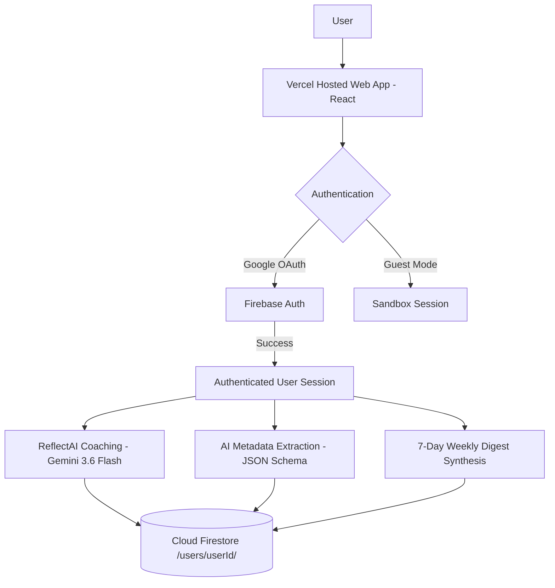

# ReflectAI - Conversational Journaling & AI Reflection Coach

A production-ready full-stack web application combining **Next.js / React**, **Firebase Authentication (Google Auth)**, **Cloud Firestore**, and the **Google Gen AI SDK (`@google/genai`)** with **Gemini 3.6 Flash**.

---

## 🌟 Features & Architecture



1. **Public Landing & Authentication**: Clean splash page with Google Sign-In (`signInWithPopup` via Firebase Auth) and guest sandbox mode.
2. **Private Authenticated Dashboard**: Guarded by Firebase Auth state with isolated user context.
3. **Conversational AI Reflection Coach**: Multi-turn dialogue with Gemini (with system instructions acting as a non-judgmental, Socratic reflection mentor).
4. **Automated AI Metadata Extraction**: Structured JSON schema output extracting sentiment/mood, polarity score, 3-5 topic tags, reflection synthesis, and actionable growth takeaways.
5. **Strict Firestore Data Isolation**: Zero cross-user data exposure enforced by owner-bound Firestore Security Rules at `/users/{userId}/journal_entries/{entryId}`.
6. **Journal History & Analytics**: Search, mood filters, tag filters, date filtering, and Markdown export.
7. **Automated Weekly Digest**: Synthesizes 7-day entry history into executive summaries, emotional trajectories, and tailored mindfulness prompts.
8. **Resilient Model Fallback Ladder**: Built-in fallback chain (`gemini-2.5-flash` → `gemini-2.5-flash-lite` → `gemini-flash-latest` → `gemini-2.5-pro`) handling API recovery gracefully.

---

## 🛡️ Firestore Security Rules

Deploy the following rules via Firebase CLI or Cloud Console to enforce strict user data isolation:

```javascript
rules_version = '2';
service cloud.firestore {
  match /databases/{database}/documents {
    // Deny unauthorized root-level access
    match /{document=**} {
      allow read, write: if false;
    }

    // User-isolated collection tree
    match /users/{userId} {
      allow read, write: if request.auth != null && request.auth.uid == userId;

      // Isolated journal entries and AI coaching dialogue
      match /journal_entries/{entryId} {
        allow read, write: if request.auth != null && request.auth.uid == userId;
      }

      // Isolated weekly digests
      match /weekly_digests/{digestId} {
        allow read, write: if request.auth != null && request.auth.uid == userId;
      }
    }
  }
}
```

---

## 🔐 Google Cloud Secret Manager Setup

Store your Gemini API credentials securely without hardcoding:

```bash
# 1. Create and populate the secret
gcloud secrets create GEMINI_API_KEY --replication-policy="automatic"
echo -n "YOUR_GEMINI_API_KEY" | gcloud secrets versions add GEMINI_API_KEY --data-file=-

# 2. Grant the Cloud Run service account access to read the secret
gcloud secrets add-iam-policy-binding GEMINI_API_KEY \
  --member="serviceAccount:YOUR_PROJECT_NUMBER-compute@developer.gserviceaccount.com" \
  --role="roles/secretmanager.secretAccessor"
```

---

## 🚀 Cloud Run Deployment & Verification

### 1. Build and Deploy to Cloud Run

```bash
gcloud run deploy reflect-ai \
  --source . \
  --platform managed \
  --region us-central1 \
  --allow-unauthenticated \
  --set-secrets GEMINI_API_KEY=GEMINI_API_KEY:latest
```

### 2. Apply Mandatory Campaign Verification Label

```bash
gcloud run services update reflect-ai \
  --update-labels=dev-tutorial=cloud-run-ai-challenge \
  --region=us-central1
```

---

## 🧪 Functional Walkthrough & Test Guide

### Test Case 1: Google Authentication (Dev Preview Mock & Live OAuth)
1. Navigate to the landing page.
2. In the AI Studio iframe preview, observe that **Auth Strategy** is set to **Dev / Preview Mock Mode** by default.
3. Click **"Sign in with Google (Instant Test User)"**.
4. Confirm instant login as `Test User (test@example.com)` with immediate access to all Gemini AI reflection coaching, metadata extraction, and sample journals without being blocked by iframe popup restrictions.
5. Alternatively, click **"Switch to Live OAuth"** to test standard Firebase Google popup authentication (or when deployed to Cloud Run in production).
6. Click **"Sign Out"** in the top navigation bar to return to the landing screen.

### Test Case 2: Multi-Turn Conversational Coaching
1. In the **Reflect & Journal** tab, type a draft or select a prompt pill (e.g., *Energy Audit*).
2. In the right-side **ReflectAI Coach** panel, send a message (e.g., *"I'm feeling stuck on a decision today."*).
3. Confirm that Gemini responds with empathetic Socratic guidance within 2-3 seconds.
4. Continue with a follow-up response to verify multi-turn context retention.

### Test Case 3: Automated AI Metadata Extraction & Persistence
1. Click **"Extract Insights with Gemini"**.
2. Verify that structured output populates:
   - Primary Sentiment (e.g., *Reflective*, *Anxious*, *Grateful*)
   - Auto-generated topic tags (e.g., `#Work-Life Balance`, `#Mindfulness`)
   - Synthesis & Actionable Growth Takeaway
3. Click **"Save Reflection"**.
4. Confirm success toast and verify that the entry is written to Firestore at `/users/{userId}/journal_entries/{entryId}`.

### Test Case 4: Search, Tag Filtering & History Inspection
1. Navigate to the **Past Entries & Analytics** tab.
2. Type a keyword into the search bar or click a tag chip (e.g., `#Mindfulness`).
3. Verify that the entry list filters reactively.
4. Click an entry card to view the complete transcript, energy level, and export as Markdown.

### Test Case 5: Automated 7-Day Weekly Digest
1. Navigate to the **Weekly Digest** tab.
2. Click **"Synthesize New 7-Day Digest"**.
3. Confirm that Gemini aggregates all entries from the past 7 days, extracting:
   - Executive Summary
   - Top Life Themes
   - Breakthroughs & Resilience
   - Recurring Patterns
   - Actionable Mindfulness Prompts for next week.

---

## 🛡️ Threat Model & OWASP Countermeasures

| Threat Zone | Scenario | OWASP Standard | Architectural Countermeasure |
| :--- | :--- | :--- | :--- |
| **1. Input Surfaces** | Malicious payloads / prompt injections | OWASP LLM01 / A03 | Defensive destructuring, payload size limits (10MB), and treating prompts as data. |
| **2. Planning & Reasoning** | System instruction bypass | OWASP LLM02 / LLM07 | Socratic system prompts, temperature bounded (0.7), and JSON schema enforcement. |
| **3. Tool Execution** | Rate limit disruption (429/503) | OWASP LLM04 / A05 | Multi-tiered Resilient Model Fallback Ladder (`gemini-2.5-flash` → `gemini-2.5-flash-lite` → `gemini-flash-latest` → `gemini-2.5-pro`). |
| **4. Memory & State** | Cross-user data leakage / undefined crash | OWASP A01 / A04 | Owner-bound Firestore path (`/users/{uid}/*`), `request.auth.uid == userId`, and recursive undefined-stripping. |
| **5. Inter-System** | Token/API key exposure in browser | OWASP A02 / LLM06 | `GEMINI_API_KEY` stored strictly server-side; federated Google OAuth. |
